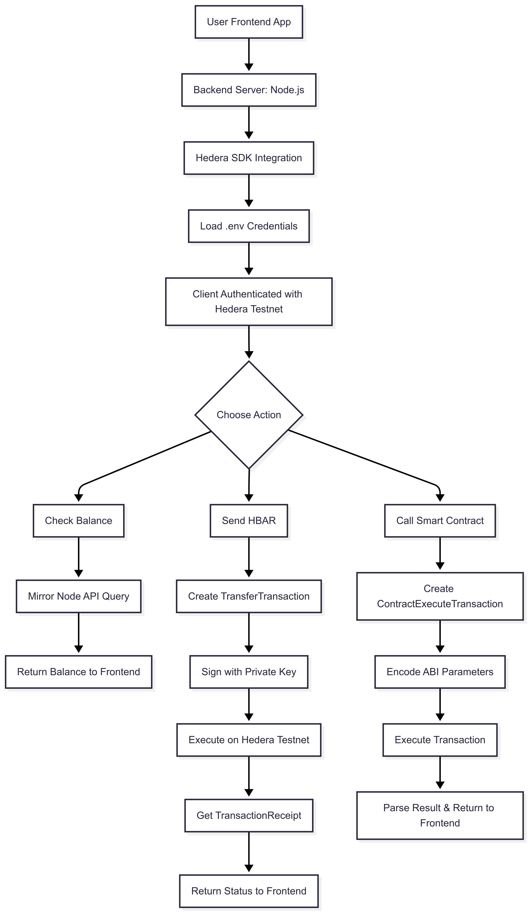
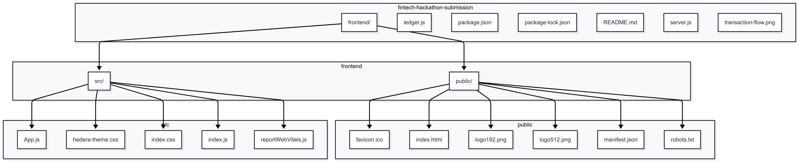

# LeafLedger - Immutable Expense Logging for Student-led Events

## Setup

1. Create a hedera testnet account on https://portal.hedera.com/register

2. Clone the repo:
   ```
   git clone https://github.com/Sohail103/LeafLedger.git
   cd LeafLedger
   ```

3. Install backend dependencies:
   ```
   npm install
   ```

4. Install frontend dependencies:
   ```
   cd frontend
   npm install
   cd ..
   ```

5. Create a `.env` file in the root with your Hedera credentials:
   ```
   OPERATOR_ID=0.0.xxxxxxx
   OPERATOR_KEY=302e020100300506032b657004220420xxxxxxxxxxxxxxxxxxxxxxxxxxxxxxxxxxxxxxxxxxxxxxxxxxxxxxxxxxxxxxxx
   ```
   
   (OPERATOR_ID: Account ID, OPERATOR_KEY: DER encoded private key) 

## Running

- Start the backend:
  ```
  node server.js
  ```

- Start the frontend:
  ```
  cd frontend
  npm start
  ```

- Open [http://localhost:3000](http://localhost:3000) in your browser.
- On the landing page, click on the LeafLedger logo to continue to the main screen
- Verified working hedera topic ID: ```0.0.6370391``` (https://hashscan.io/testnet/topic/0.0.6370391)
- After logging a few transactions, click "Calculate net amounts" to fetch all topic messages and see the net amount spent by each participant.
- Note: If you're using the topic ID ```0.0.6370391``` as I've given, there may already be a few transactions that I put in for testing. 

## Tech Stack

- Backend: Node.js and [Hedera](https://hedera.com/) SDK to create/join topics and publish/subscribe to messages on the hedera testnet
- Frontend: React

## Why LeafLedger fits the problem statement

Key problems in student-led events:
- Untracked spending
- Delayed or missing reimbursements
- Lack of transparency and trust

LeafLedger solves this by: 
- Public logging: Every transaction is published to a hedera topic - this makes the expense trail transparent and immutable
- Tamper-proof: Hedera's consensus mechanism ensures no one can edit or delete records later
- Decentralized visibility: Anyone with access to the topic ID can verify contributions without relying on a central admin like the college, therefore completely eliminating the risk of unprocessed reimbursements.
- Event wise partitioning: Organizers and volunteers of each event can decide on a topic ID beforehand and everyone contributing logs their contribution on this topic. This way multiple topics, one for each event, allows for per-event bookkeeping.

## About Hedera Hashgraph

Hedera is a public distributed ledger platform designed to offer a fast, secure, and energy-efficient alternative to traditional blockchain technologies. Unlike blockchains like Bitcoin and Ethereum that rely on Proof-of-Work (PoW) or Proof-of-Stake (PoS), Hedera is built on a unique consensus mechanism called Hashgraph. This makes it significantly more cost-effective to implement (in our case, entirely free by using the Hedera Testnet) and far more environmentally friendly, as it avoids the energy-intensive mining required by PoW-based blockchains.

### Why choose a distributed database instead of a traditional SQL database?

Instead of using a traditional SQL based database, this project uses hedera hashgraph, a distributed ledger, to store all transaction data. This is because traditional local SQL databases can be easily tampered or manipulated behind the scenes by whoever has access to the main server storing the SQL data. In contrast, distributed ledgers provide immutable, append-only records making them ideal for applications involving money and trust. Every transaction on hedera is public and traceable to the account ID that submitted it. While account numbers are currently hardcoded via environment variables this still alows for clear accountability. 
If an error is made like logging an incorrect amount, the a reverse transaction can simply be submitted with a note explaining the correction which can be verified as correct if it comes from the same account that made the faulty transaction. The logic for calculating the final amounts owed to everyone would then compute the correct amount for each person.

### How Hedera Works: Hashgraph Consensus

The Hashgraph consensus algorithm, invented by Dr. Leemon Baird, does not use blocks or mining. Instead, it uses two core ideas: **gossip about gossip** and **virtual voting**.

- **Gossip about Gossip**: Each node in the network randomly communicates with other nodes, sharing not only new transactions but also information about how and when it learned of them. This creates a detailed history of message flow across the network.
- **Virtual Voting**: Because every node receives the same transaction history, they can independently determine the outcome of votes without exchanging actual vote messages. This significantly reduces communication overhead and enables quick consensus.

This design allows Hedera to reach asynchronous Byzantine Fault Tolerance (aBFT), a high level of security where the system can function correctly even if some nodes act maliciously. The result is high throughput, low latency, and strong security guarantees—all while consuming very little energy compared to traditional blockchains.

### Why This Project Uses Hedera

In this project, I built a public payment ledger to record transactions between students during a college fest. While the actual payments are made via UPI or other external services, this system acts as an immutable record of contributions, expenses, and reimbursements.

Hedera was chosen for several reasons:

- **Speed and Scalability**: Transactions are finalized within seconds, making it suitable for handling many updates during the event.
- **Transparency**: The public ledger enables all stakeholders to verify entries, increasing trust and accountability.
- **Developer-Friendly SDK**: Hedera provides a straightforward JavaScript SDK, allowing easy integration with minimal overhead.
- **Free Testing Environment**: The Hedera testnet supports development and testing without requiring real currency or fees.

The transactions can then be collected and parsed after the fest to compute the net amount of money spent by each student and reimbursements to be paid.

## Future improvements:

- a better UI and an authentication screen so people dont have to create a .env file with their credentials hardcoded in
- facility to automatically collect transactions from the hedera mirror node REST APIs and calculate net amount owed to each student (completed and added the feature)

### Transaction summary feature:
LeafLedger can now query Hedera topics and fetch all logged transactions. These are parsed and displayed in a table showing how much each individual has contributed, allowing organizers to calculate reimbursements quickly and transparently all in one place. This feature was implemented using the hedera mirror node REST API accessed through the hedera SDK.

## Transaction flow



## Overall project structure



(diagrams generated with mermaid.js)
